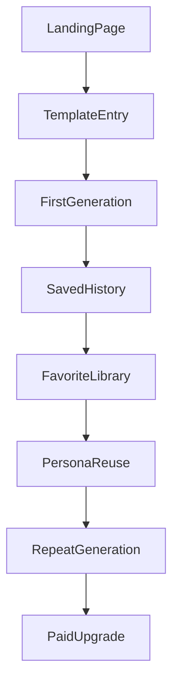

# Retention Loop

## 目标

把 HighEQ 从“一次性生成器”推进为“用户会反复回来使用的沟通助手”。

当前仓库里已经具备这条链路的基础：

- 获取用户：`high-eq-front/client/src/pages/Home.tsx`
- 登录注册：`high-eq-front/client/src/pages/Login.tsx`、`high-eq-front/client/src/pages/Register.tsx`
- 核心生成：`high-eq-front/client/src/pages/ReplyApp.tsx`
- 历史与收藏：`high-eq-front/client/src/pages/History.tsx`、`high-eq-front/client/src/pages/Favorites.tsx`
- 用户资产表：`high-eq-backend/src/main/resources/db/init.sql`

## 留存闭环

## 已落地基础

- 在 `ReplyApp` 中增加了高频模板场景入口，降低首次使用门槛。
- 模板数据集中在 `high-eq-front/client/src/data/scenarioTemplates.ts`，当前共 20 个模板，覆盖：
  - 关系沟通
  - 职场表达
- 模板点击后会自动填充角色、对方消息、真实意图和语气，直接缩短首个成功时刻。

## 下一步要补的 4 个关键动作

### 1. 二次改写链路

当前用户只能“从零生成”，但更高频的需求通常是“我已经写了一句，帮我改得更得体”。

建议补充：

- 输入一个已有草稿
- 选择改写目标：
  - 更温柔一点
  - 更坚定一点
  - 更像微信口语
  - 更正式
  - 更简短
- 保留原文与改写版对比

建议接口扩展：

- 复用 `POST /reply/generate`
- 在请求体中增加可选字段：
  - `draftReply`
  - `rewriteGoal`
  - `conversationGoal`

## 2. 收藏升级为沟通素材库

当前收藏是“收藏整条历史记录”，适合 MVP，但不适合长期复用。

建议升级方向：

- 收藏对象从 history 细化到 suggestion
- 支持标签：
  - 道歉
  - 拒绝
  - 催办
  - 安抚
  - 破冰
- 支持搜索
- 支持二次编辑后另存
- 支持从历史记录直接保存为模板

建议数据改造：

- 新增 `saved_reply_template` 表
- 允许一条 `reply_suggestion` 被保存为用户私有模板

建议字段：

- `id`
- `user_id`
- `source_suggestion_id`
- `title`
- `content`
- `tone`
- `scene_tag`
- `role_background`
- `is_pinned`
- `create_time`
- `update_time`

## 3. 个人画像与自定义角色

数据库里已经有 `preset_role` 和 `custom_role`，但还没有产品化。

建议把它变成真正的长期记忆能力：

- 用户可以保存“我领导的沟通风格”
- 用户可以保存“我对象的说话习惯”
- 用户可以保存“我自己的表达偏好”

最小可用字段建议：

- `role_name`
- `description`
- `typicalTone`
- `tabooTopics`
- `preferredStyle`

产品入口建议：

- 在生成页增加“使用已保存画像”
- 在个人中心增加“我的沟通画像”
- 在历史详情中支持“保存为画像模板”

## 4. 最小埋点体系

没有埋点，就很难判断到底该优先做情感沟通还是职场表达。

建议最小事件表：

- `view_home`
- `click_start`
- `select_template`
- `generate_reply`
- `copy_suggestion`
- `favorite_history`
- `return_next_day`
- `view_pricing`
- `click_pro_cta`

建议事件属性：

- `user_id`
- `template_id`
- `template_category`
- `role_background`
- `tone`
- `reply_count`
- `source_page`
- `session_id`
- `created_at`

## 优先级建议

1. 模板入口
2. 二次改写
3. 埋点
4. 素材库
5. 个人画像

## 验收标准

- 新用户进入生成页后，能在 10 秒内找到至少 1 个可直接套用的场景
- 模板使用率超过纯手输使用率的一定比例
- 收藏不再只是“存档”，而是可以再次套用
- 至少能回答两个问题：
  - 用户更常用关系沟通还是职场表达
  - 用户升级 Pro 的主要原因是额度、模板还是个性化
